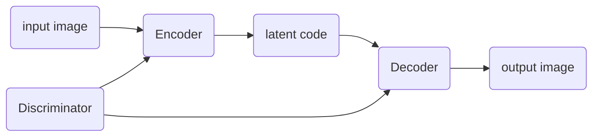

**Task1: Generate multi-view images from a single-view input**

**impact**

> broad applications in vision, graphics, and robotics

**related work**

> model-driven synthesis: 
>
> data-driven generation: [^Zhu et al., 2014]
>
> combination of the both [^Peng et al., 2017]
>
> GAN: [^Tran et al., 2017] [^Zhao et al., 2017]

**GAN pipeline in this problem**

disentangle pose and identity factors by cross-reconstruction [^Peng et al., 2017][^Zhu et al., 2014]

[^Peng et al., 2017]:Reconstruction-based disentanglement for pose-invariant face recognition
[^Zhu et al., 2014]:Multi-view perceptron: a deep model for learning face identity and view representations
[^Tran et al., 2017]:Disentangled Representation Learning GAN for Pose-Invariant Face Recognition
[^Zhao et al., 2017]: Multi-view image generation from a single-view

## CR-GAN

[CR-GAN: Learning Complete Representations for Multi-view Generation]()

**`[IJCAI 2018]`**	**`(Rutgers University)`**	**`[Yu Tian, Xi Peng]`**	**([:memo:]())**	**[[:octocat:](https://github.com/bluer555/CR-GAN)]**

Click to expand

> **Keywords**

Two-pathway

> **Novelty**

maintain the completeness of the learned embedding space.

> **Pipeline**

The generator produces a synthesis image  with a random noise under a view label.

The discriminator contains two parts). estimates the image quality, i.e., how real the image is, predict the view of given image.

The encoder reconstructs a latent vector from an image, in other words, will be learned as an inverse of and the latent space could represent the total image space.

In this problem, the output of should preserve the same identity and we hope could disentangle the viewpoint from the identity.

To be specific, we first sample a pair of real images) which are the same identity but different views. The goal is to reconstruct from. To achieve this, takes as an input and outputs an identity-preserved representation together with the view estimation: = E(\boldsymbol{x}_i)). takes and as input, then produce which should be the reconstruction of. 

在第一轮训练中，训练 和， 想尽可能生成与真图像的假图， 想尽可能分辨出真图和假图。 

, D_s(G(\boldsymbol{z}, v))\}) 和, v\}) 差距要尽可能小

> 只能同时识别身份和角度，建立的是真图和假图之间的关系，还缺乏同一身份不同角度真图或者假图之间的关系

在第二轮训练中，训练 和，希望弥补上面的缺陷， 想尽可能解码出身份信息和角度信息，所以只要解开了， 就能继续生成，但 需要重新训练别让把相同身份不同位置的

|                                                              |                                                              |      |
| :----------------------------------------------------------: | :----------------------------------------------------------: | :--: |
|  | real image with view |      |
|  | real image with view |      |
|  = (E_{\boldsymbol{z}}(\boldsymbol{x}_i), E_v(\boldsymbol{x}_i) )) |                                                              |      |
| ,v_j)) |                          fake image                          |      |

- 

---

